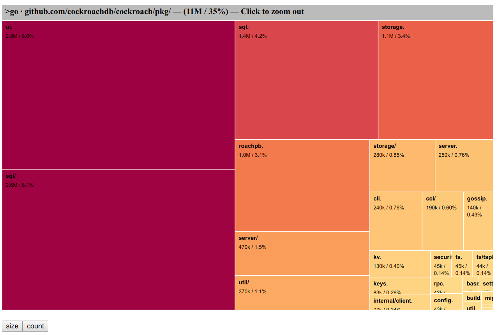

# Go executable size visualization using D3

This directory contains code and data to visualize the contents of Go
binaries.

## Example output



## How to use

Apply tools in order (Python 3 required):

1. `go tool nm -size <binary file> | c++filt` and redirect to some file, e.g. `symtab.txt`

   (provided with the Go toolchain.)

2. `python3 tab2pydic.py` on the previously generated file, redirect to e.g. `out.py`

3. `python3 simplify.py` on the previously generated file, redirect to `data.js` **specifically**

4. `python3 -m http.server`

5. open browser on http://localhost:8000/treemap_v3.html

### Using Docker

For example:
```shell
docker run -v $GOPATH/bin/:/go/bin -p 8000:8000 odedp/go-binsize-viz -b /go/bin/dep
```

(Use `-b` to target the Go executable.)

## Included example data using CockroachDB

1. `python3 -m http.server`

2. open browser on http://localhost:8000/cockroach_sizes.html

## Origin of the D3 viz source code

This repo uses D3 visualization code inspired from / modifying the
following sources:

- Jacques Jahnichen's zoomable treemap at http://bl.ocks.org/JacquesJahnichen/42afd0cde7cbf72ecb81

- ported to D3 v4 by Guglielmo Celata at http://bl.ocks.org/guglielmo/16d880a6615da7f502116220cb551498

## Licensing

The Python bits (and thus the Docker embedding) are licensed under the
Affero GPL3. This requires derived software to also use AGPL3, and
prevents network usage without distribution of source code.

The D3 / Javascript bits in `app3.js` (see previous section) are currently
UNLICENSED. They cannot be reused in derived work or other applications
without direct permission from the original author.

The files in the `js` subdirectory are imported from the D3.js project
(https://d3js.org/) and are licensed under the terms of the 3-Clause
BSD license.
